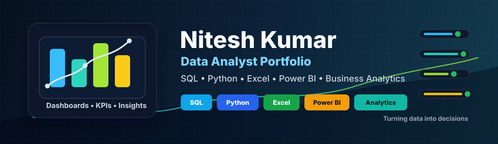

<div align="center">
  
</div>

<h1 align="center">Nitesh Kumar</h1>

<h3 align="center">
  Data Analyst | Business Analytics | SQL | Python | Excel | Power BI
</h3>

<p align="center">
  <a href="https://www.linkedin.com/in/nitesh-kumar-87b2a8225">
    
  </a>
  <a href="mailto:kumarniteshsingh88640@gmail.com">
    
  </a>
  <a href="https://github.com/NiteshKumar6?tab=repositories">
    
  </a>
</p>

<br />

<h2>🧑‍💻 About Me</h2>

```text
👨‍💼 Name:       Nitesh Kumar
📍 Location:   India
🎯 Role:       Data Analyst | Business Analyst
📧 Email:      kumarniteshsingh88640@gmail.com
🔗 LinkedIn:   linkedin.com/in/nitesh-kumar-87b2a8225
```

> Passionate about converting raw data into useful business insights. I work with SQL, Python, Excel, Power BI, statistics, and dashboards to answer real business questions and communicate clear recommendations.

---

<h2>🛠️ Skills & Tools</h2>

<h3>Languages & Querying</h3>

<p>
  
  
  
  
</p>

<h3>Analytics & BI</h3>

<p>
  
  
  
  
  
  
</p>

<h3>Database & Workflow</h3>

<p>
  
  
  
  
  
  
</p>

---

<h2>🚀 Featured Projects</h2>

| Project | Description | Tech Stack | Status |
|---|---|---|---|
| [Sales Performance Dashboard Analysis](https://github.com/NiteshKumar6/sales-performance-dashboard-analysis) | Retail sales analysis covering revenue trends, top products, regions, customer segments, and dashboard-ready reporting | SQL, Python, Excel, Power BI | ✅ Active |
| [HR Employee Attrition Analysis](https://github.com/NiteshKumar6/hr-employee-attrition-analysis) | Employee attrition analysis focused on turnover drivers, department patterns, overtime, satisfaction, and retention insights | Python, pandas, Power BI | ✅ Active |
| [E-commerce Customer Analysis](https://github.com/NiteshKumar6/ecommerce-customer-analysis) | Customer behavior analysis covering repeat purchase rate, high-value customers, category revenue, and segmentation | SQL, Python, Power BI | ✅ Active |
| [COVID-19 Data Analysis and Visualization](https://github.com/NiteshKumar6/covid19-data-analysis-and-visualization) | COVID-19 trend analysis with regional comparisons, recovery rate, mortality rate, active cases, and dashboard visuals | Python, pandas, visualization | ✅ Active |
| [Business Analytics Portfolio](https://github.com/NiteshKumar6/business-analytics-portfolio) | Central analytics portfolio hub for SQL, Python, Excel, Power BI, statistics, and business case studies | SQL, Python, Excel, Power BI | ✅ Active |

---

<h2>📊 GitHub Stats & Activity</h2>

<div align="center">
  
  
</div>

<div align="center">
  
</div>

---

<h2>🏆 Achievements & Highlights</h2>

- Built a focused analytics portfolio around SQL, Python, Excel, Power BI, and statistics
- Created case-study repositories for business analytics, churn analysis, sales dashboards, finance dashboards, and A/B testing
- Hands-on experience with frontend projects, Java projects, dashboards, and data analysis workflows
- Strong focus on business problem framing, KPI tracking, insight generation, and recommendation writing
- Continuously improving GitHub projects into recruiter-friendly portfolio work

---

<h2>🌱 What I'm Working On</h2>

- 🔄 Completing end-to-end analytics case studies with datasets, findings, and recommendations
- 📊 Building Power BI and Excel dashboards with clear KPI storytelling
- 🧪 Practicing A/B testing, hypothesis testing, confidence intervals, and regression
- 🐍 Improving Python data analysis with pandas, visualization, and machine learning basics
- 🧠 Strengthening SQL joins, CTEs, subqueries, window functions, and business reporting

---

<h2>💡 Currently Learning</h2>

- Advanced SQL for analytics interviews
- Power BI dashboard design and DAX measures
- Python data cleaning and exploratory data analysis
- Statistics for business experiments
- Business communication and executive summary writing

---

<h2>📈 Quick Facts</h2>

| | |
|---|---|
| 🎯 | Focused on Data Analytics and Business Analytics roles |
| 📊 | Building practical dashboards and business case studies |
| 🧮 | Comfortable with SQL, Excel, Python, and Power BI |
| 📝 | Interested in turning analysis into clear business recommendations |
| 🤝 | Open to internships, entry-level roles, and analytics project opportunities |

---

<h2>🎯 My Goals</h2>

- ✨ Build a strong recruiter-ready analytics portfolio
- ✨ Publish complete SQL, Python, Excel, and Power BI projects
- ✨ Improve business storytelling with every project
- ✨ Contribute to open-source analytics and dashboard projects
- ✨ Become job-ready for Data Analyst and Business Analyst roles

---

<h2>📬 Connect With Me</h2>

<p>
  <a href="https://www.linkedin.com/in/nitesh-kumar-87b2a8225">
    
  </a>
  <a href="mailto:kumarniteshsingh88640@gmail.com">
    
  </a>
</p>
